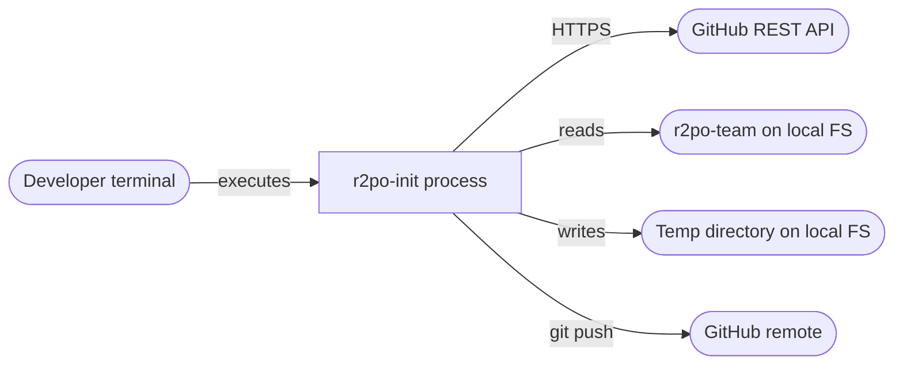

# Platform Architecture

Project: r2po-init
Version: 0.1
Status: draft
Last updated: 2026-04-17
Authors: Architect + DevOps (R2PO)

---

## 1. Environments

| Environment | Purpose | Infrastructure |
|---|---|---|
| local | Development, testing, and production use | WSL2, Python 3.11+, pip |

`r2po-init` is a developer tool, not a server. It runs as a single process directly on the developer's WSL2 instance. There are no containers, no Docker Compose services, and no persistent background processes. This document covers the local environment only; no further environments are planned.

---

## 2. Runtime topology

There is one runtime component: the `r2po-init` Python process. It runs to completion and exits. No containers are involved.



The tool accesses two external systems:
- **GitHub REST API** — via PyGithub, authenticated by the token from `gh auth token`.
- **r2po-team local directory** — read-only; must exist at `~/ns/r2po/r2po-team` before the tool is run.

---

## 3. Installation

The tool is installed as a pip package from the project directory. No package registry is used.

```bash
# From the r2po-init project directory inside WSL2:
pip install -e .
```

After installation, the `r2po-init` command is available on PATH within the active Python environment.

**Requirements:**
- Python 3.11 or later
- pip
- `git` CLI installed and on PATH
- `gh` CLI installed, authenticated (`gh auth login` completed)

**Python dependencies** (defined in `pyproject.toml`):
- `typer >= 0.12`
- `PyGithub >= 2.0`
- `rich >= 13.0`

---

## 4. Environment variables

The tool uses no environment variables. It reads the GitHub token exclusively from `gh auth token` at startup. No `.env` file is needed or created.

---

## 5. Secrets provisioning

The only secret is the GitHub personal access token managed by the `gh` CLI. The developer must have completed `gh auth login` with an account that has the following GitHub scopes:

- `repo` — create and delete repositories
- `delete_repo` — delete repositories (needed for rollback)
- `admin:org` — add labels to a repository in an organization

The tool does not create, store, or rotate this token. If the token is expired or missing the required scopes, the tool exits immediately with a non-retryable auth error before making any changes.

---

## 6. Filesystem paths

| Path | Description | Lifecycle |
|---|---|---|
| `~/ns/r2po/r2po-team` | Source of all templates (hardcoded) | Permanent; must exist before running |
| `<cwd>/r2po-init-error-<timestamp>.txt` | Error report written on abort | Created on failure; persists after exit |
| System temp directory | Local git working directory during init | Created at run start; deleted on exit (success or failure) |

The tool uses `tempfile.mkdtemp()` for its working directory. It cleans up the temp directory in a `finally` block so it is always removed, even on failure.

---

## 7. Logging

- **Output channel**: stdout for progress messages, stderr for error messages.
- **Format**: human-readable plain text formatted with Rich (progress steps, status icons, error panels). No JSON logging.
- **Verbosity**: single level — all progress steps are printed. There is no `--verbose` or `--quiet` flag.
- **Error report**: written to disk on failure (see §6). Distinct from stderr output; the report is the persistent record, stderr is the immediate signal.

Progress output format per step:
```
[✓] Created repository NovaSoftworks/my-project
[✓] Applied 6 R2PO labels
[✓] Seeded templates (11 files)
[✓] Created first commit
[✓] Pushed to remote
```

On failure:
```
[✗] Failed at: Apply R2PO labels (network timeout after 3 retries)
    Rolling back...
[✓] Deleted repository NovaSoftworks/my-project
    Error report written to: r2po-init-error-2026-04-17T14-32-00.txt
```

---

## 8. WSL2 notes

- The project source (`r2po-init`) and the r2po-team directory must both live under `/home/<username>/` inside the WSL2 filesystem, not under `/mnt/c/`. File I/O on the Windows mount is significantly slower and can cause issues with git operations.
- The tool makes outbound HTTPS calls to `api.github.com`. WSL2 shares the Windows host network stack; no additional network configuration is needed.
- The `gh` CLI must be installed inside WSL2 (not the Windows host). Run `which gh` to confirm.
- There are no persistent volumes or services that need to survive a WSL2 restart.
- Recommended WSL2 memory allocation: the tool is lightweight; the default WSL2 memory limit is sufficient.

---

## 9. Decisions and deviations

| # | Decision or deviation | Reason | Date |
|---|---|---|---|
| 1 | No Docker Compose | The tool is a single-process CLI with no services to orchestrate; containers would add complexity with no benefit | 2026-04-17 |
| 2 | No `.env` file | The tool uses no environment variables; secrets come exclusively from `gh auth token` | 2026-04-17 |
| 3 | Temp directory for git working tree | Avoids leaving partial state in any user-visible directory; always cleaned up in `finally` | 2026-04-17 |

---

## 10. Change log

| Version | Date | Change | Author |
|---|---|---|---|
| 0.1 | 2026-04-17 | Initial draft | Architect + DevOps |
