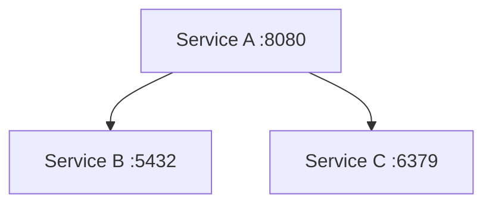

# Platform Architecture

Project: [project name]
Version: 0.1
Status: draft | approved
Last updated: [date]
Authors: Architect + DevOps (R2PO)

---

## 1. Environments

| Environment | Purpose | Infrastructure |
|---|---|---|
| local | Development and testing | WSL2, Docker Compose |
| [next env] | [purpose] | [infrastructure] |

This document covers the local environment. Future environments will be added as separate sections when they are defined.

---

## 2. Service topology

List all services that run as containers. Describe how they relate to the components in `architecture/system.md`.

| Service name | Image | Role |
|---|---|---|
| [service] | [image:version] | [what it does] |

### 2.1 Topology diagram

---

## 3. Docker Compose configuration

### 3.1 Services

For each service, document its configuration intent. The actual definition is in `docker-compose.yml`.

**[service name]**
- Image: [image:version]
- Ports: [host:container]
- Volumes: [named volume or bind mount and its purpose]
- Depends on: [other service, with health condition if relevant]
- Health check: [what it checks and how]
- Key environment variables: [list, with descriptions - do not put values here]

---

## 4. Networking

- All services run on a shared Docker network named `[network name]`.
- Services communicate by service name (e.g. `http://api:3000`).
- Only the following ports are exposed to the host:

| Service | Host port | Container port | Purpose |
|---|---|---|---|
| [service] | [port] | [port] | [who accesses this] |

---

## 5. Volumes

| Volume name | Used by | Purpose |
|---|---|---|
| [volume] | [service] | [what data it holds and why it is persisted] |

---

## 6. Environment variables

Full list of environment variables used across all services. Values are in `.env` (not committed). A safe example is in `.env.example` (committed).

| Variable | Service | Description | Secret |
|---|---|---|---|
| [VAR_NAME] | [service] | [what it configures] | yes / no |

---

## 7. Secrets provisioning

Variables marked as secret above must be provisioned manually. Document how.

- [VAR_NAME]: [where to get this value and how to set it]

---

## 8. Logging

- Log format: [JSON / plain text]
- Log level controlled by: [environment variable name]
- Where logs go in local environment: [stdout / named volume / file path]
- How to view logs locally: [command or tool]

---

## 9. Health checks and startup order

Describe the expected startup sequence and how health is verified.

1. [service] starts first. Health check: [check description].
2. [service] starts after [service] is healthy. Health check: [check description].
3. [continue for all services]

---

## 10. WSL2 notes

- Project files must be stored under `/home/[username]/` inside WSL2, not under `/mnt/c/`. File I/O on the Windows mount is slow.
- To access a service from Windows, use `localhost:[host port]` in the browser or API client.
- WSL2 memory limit is configured in `%UserProfile%\.wslconfig`. Recommended minimum for this project: [amount].

---

## 11. Decisions and deviations

Record significant platform decisions and any deviations from this document that occurred during implementation.

| # | Decision or deviation | Reason | Date |
|---|---|---|---|
| 1 | [description] | [why] | [date] |

---

## 12. Change log

| Version | Date | Change | Author |
|---|---|---|---|
| 0.1 | [date] | Initial draft | Architect + DevOps |
