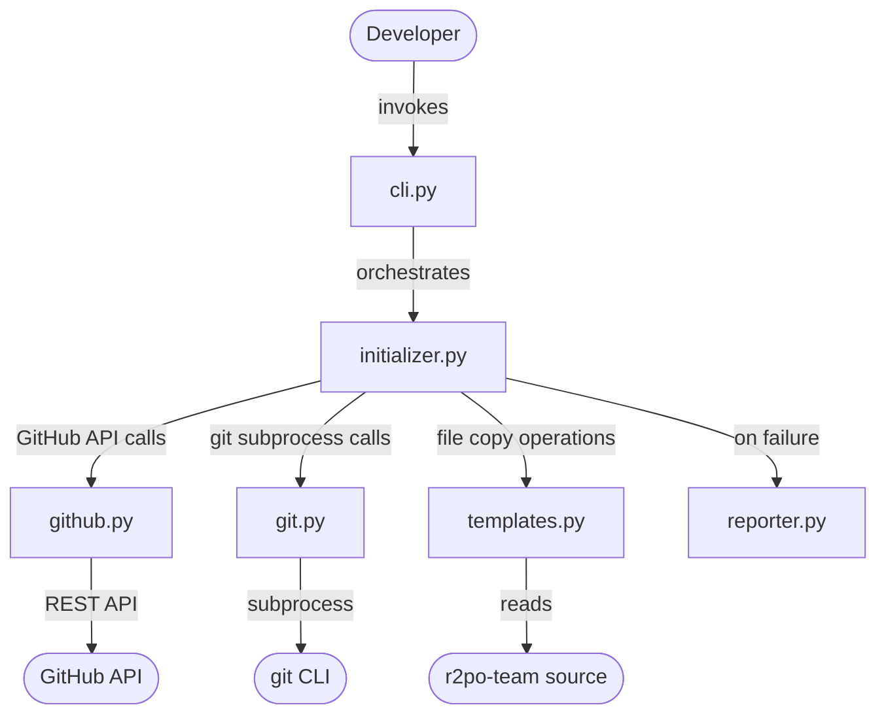
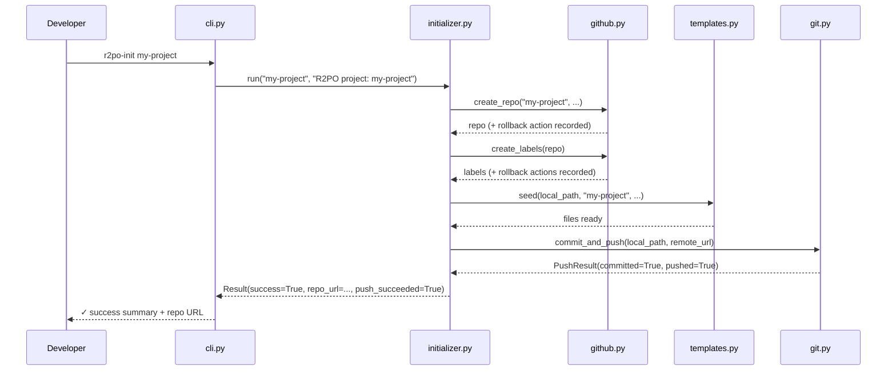
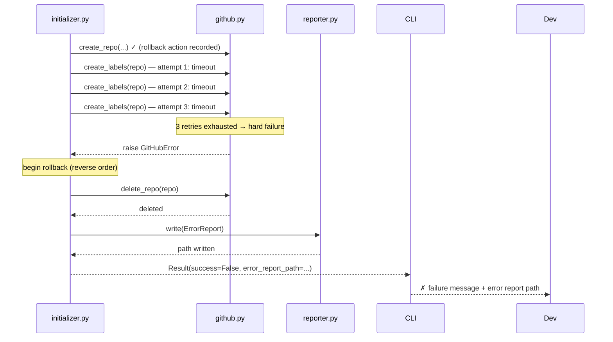

# System Architecture

Project: r2po-init
Version: 0.1
Status: approved
Last updated: 2026-04-17
Author: Architect (R2PO)

---

## 1. Overview

`r2po-init` is a single-process Python CLI tool. The developer invokes it from a terminal; it runs to completion and exits. There is no server, no background process, and no persistent storage beyond the error report written on failure. The tool is structured as six modules with a strict dependency hierarchy: `cli` depends on `initializer`; `initializer` depends on `github`, `git`, `templates`, and `reporter`; none of these lower modules depend on each other or on `cli`.

### 1.1 Component diagram



---

## 2. Technology stack

| Layer | Technology | Justification |
|---|---|---|
| Language | Python 3.11+ | Available on all WSL2 distros by default; first-class support for CLI tooling; no compilation step; chosen over Go (overkill for a one-shot script) and Bash (too fragile for retry/rollback state management) |
| CLI framework | Typer 0.12+ | Built on Click; provides argument parsing and interactive prompts from a single declaration; cleaner than argparse for dual CLI/interactive mode |
| Terminal output | Rich 13+ | Formatted progress output, coloured status lines, and error panels; chosen over plain print statements to make step-by-step output legible |
| GitHub API | PyGithub 2.x | Pythonic wrapper around the GitHub REST API; chosen over raw `requests` for its typed response objects, which make error categorisation (rate limit, auth failure, not found) unambiguous |
| Git operations | subprocess (git CLI) | `git` is already required on the developer's machine; no additional Python library needed; direct subprocess calls over GitPython to avoid a heavy dependency for three straightforward commands |
| Packaging | pyproject.toml (setuptools) | Standard modern Python packaging; installs the tool as a `r2po-init` entry point via `pip install -e .` |

---

## 3. Components

### 3.1 `cli.py`

Responsibility: Parse CLI arguments, run interactive prompts for missing inputs, print progress and final result, and exit with the correct code.

Public interface:
- `app()` — Typer entry point. Accepts optional positional `repo_name` and optional `--description` flag. If either is missing, prompts the user. Calls `initializer.run()` and handles the return value.

Dependencies:
- `initializer.py`: delegates all work after argument collection.

### 3.2 `initializer.py`

Responsibility: Orchestrate the full initialization sequence in order, maintain the rollback journal, and trigger rollback and error reporting on failure.

Public interface:
- `run(repo_name: str, description: str) -> Result` — executes the sequence below, returns a `Result` (success or failure with details).

Sequence executed by `run()`:
1. Validate `repo_name` (pattern: `[a-z0-9-]+`, max 100 chars, per GitHub naming rules).
2. Call `github.create_repo(repo_name, description)` → record rollback action.
3. Call `github.create_labels(repo)` → record rollback action per label created.
4. Call `templates.seed(repo_local_path)` → copies all template files.
5. Call `git.commit_and_push(repo_local_path, remote_url)`.
6. Return success result.

On failure at any step: call `rollback(journal)`, then `reporter.write(report)`.

Dependencies:
- `github.py`, `git.py`, `templates.py`, `reporter.py`.

### 3.3 `github.py`

Responsibility: All GitHub API operations, with retry logic for network errors.

Public interface:
- `create_repo(name: str, description: str) -> Repository` — creates a private repo in NovaSoftworks; raises `RepoExistsError` (non-retryable) if it already exists.
- `delete_repo(repo: Repository) -> None` — used by rollback.
- `create_labels(repo: Repository) -> list[Label]` — creates or overwrites the six standard R2PO labels; returns the list of labels created (for rollback journal).
- `delete_label(repo: Repository, label_name: str) -> None` — used by rollback.

Retry behaviour: each method wraps its API call in a retry loop (up to 3 attempts, 2-second delay between attempts) that retries on `socket.timeout`, `ConnectionError`, and GitHub 5xx responses. Auth failures and 4xx responses (except 422 on repo creation) are re-raised immediately as non-retryable errors.

Dependencies:
- PyGithub, `constants.py`.

### 3.4 `git.py`

Responsibility: All local git operations via subprocess.

Public interface:
- `commit_and_push(repo_path: Path, remote_url: str, commit_message: str) -> PushResult` — runs `git init`, `git add .`, `git commit`, `git remote add`, `git push`; returns `PushResult` indicating whether push succeeded (push failure is non-fatal per BR-009).

Dependencies:
- `subprocess` (stdlib), `git` CLI on PATH.

### 3.5 `templates.py`

Responsibility: Locate the r2po-team source directory and copy the required template files into the correct paths within the new repo's local checkout directory.

Public interface:
- `seed(dest: Path, repo_name: str, description: str) -> None` — copies issue templates and doc templates from the hardcoded source path; generates `docs/status.md` and `CLAUDE.md` from inline strings (not copied from a source file).

Source path: `constants.R2PO_TEAM_PATH` (see §3.7).

Files copied from r2po-team:
- `.github/ISSUE_TEMPLATE/`: `epic.md`, `story.md`, `spike.md`, `bug.md`
- `docs/`: `functional-spec.md`, `architecture/system.md`, `architecture/platform.md`, `test-plan.md`, `test-report.md`

Files generated (not copied):
- `docs/status.md` — phase set to `1 - Discovery`, date set to current date.
- `CLAUDE.md` — see §4.2 for content.

Dependencies:
- `constants.py`, `pathlib` (stdlib), `shutil` (stdlib).

### 3.6 `reporter.py`

Responsibility: Write a human-readable error report to disk when the tool aborts.

Public interface:
- `write(report: ErrorReport) -> Path` — writes the report to the current working directory; returns the path written.

Dependencies:
- `datetime` (stdlib), `pathlib` (stdlib).

### 3.7 `constants.py`

Responsibility: Single source of truth for all hardcoded values.

Key values:
- `GITHUB_ORG = "NovaSoftworks"`
- `R2PO_TEAM_PATH = Path.home() / "ns" / "r2po" / "r2po-team"` — assumes the NovaSoftworks standard workspace layout where all R2PO repos live under `~/ns/r2po/`.
- `FIRST_COMMIT_MESSAGE = "Initialize R2PO project structure"`
- `ERROR_REPORT_FILENAME = "r2po-init-error-{timestamp}.txt"` — written to cwd; timestamp format `YYYY-MM-DDTHH-MM-SS`.
- `R2PO_LABELS` — list of `LabelDefinition` (see §4.1).
- `GITHUB_API_RETRY_COUNT = 3`
- `GITHUB_API_RETRY_DELAY_SECONDS = 2`

---

## 4. Data model

There is no database. The following structures exist in memory during a run.

### 4.1 `LabelDefinition`

| Field | Type | Description |
|---|---|---|
| `name` | `str` | Label name as it appears on GitHub |
| `color` | `str` | Six-character hex color code without `#` |
| `description` | `str` | Short label description shown in GitHub UI |

Standard R2PO label definitions:

| Name | Color | Description |
|---|---|---|
| `epic` | `0075ca` | Major capability or goal |
| `story` | `e4e669` | Single unit of user-facing functionality |
| `spike` | `d876e3` | Time-boxed investigation |
| `bug` | `d73a4a` | Defect found during QA or review |
| `blocked` | `b60205` | Cannot progress |
| `needs-review` | `0e8a16` | Waiting for human approval |

### 4.2 `RollbackAction`

| Field | Type | Description |
|---|---|---|
| `name` | `str` | Human-readable description of what the action did (e.g. `"created repo NovaSoftworks/my-project"`) |
| `undo` | `Callable[[], None]` | Zero-argument function that undoes the action when called |

The initializer maintains an ordered list of `RollbackAction` objects. On failure, it iterates in reverse and calls each `undo`. Each undo outcome (success or failure) is recorded in the `ErrorReport`.

### 4.3 `ErrorReport`

| Field | Type | Description |
|---|---|---|
| `failed_step` | `str` | Name of the step that caused the abort |
| `error_message` | `str` | Exception message (sanitised — no tokens) |
| `error_type` | `str` | `"retryable"` or `"non-retryable"` |
| `rollback_actions` | `list[RollbackOutcome]` | Each action attempted and whether it succeeded |
| `timestamp` | `datetime` | When the report was written |

### 4.4 `CLAUDE.md` stub content

The generated `CLAUDE.md` follows this template:

```
# Project: {repo_name}

{description}

Tech stack: to be determined in Phase 2.
Target environment: WSL2, run locally by the developer.

Team instructions: https://github.com/NovaSoftworks/r2po-team/blob/main/CLAUDE.md
Workflow: https://github.com/NovaSoftworks/r2po-team/blob/main/workflow.md
Current state: see docs/status.md
```

---

## 5. Component interfaces

This tool has no HTTP API. Component boundaries are Python function calls. Key interfaces:

**`initializer.run()` return type:**
```python
@dataclass
class Result:
    success: bool
    repo_url: str | None        # set on success
    push_succeeded: bool | None # set on success; False means commit exists but push failed
    error_report_path: Path | None  # set on failure
```

**`github.create_repo()` exceptions:**
```
RepoExistsError(name)       # non-retryable: repo already exists
AuthError(message)          # non-retryable: authentication or permission failure
GitHubError(message, status_code)  # retryable if 5xx, non-retryable otherwise
```

**`git.commit_and_push()` return type:**
```python
@dataclass
class PushResult:
    committed: bool
    pushed: bool
    push_error: str | None  # set if push failed; commit may still have succeeded
```

---

## 6. Key sequence diagrams

### 6.1 Happy path



### 6.2 Network failure with rollback



---

## 7. Non-functional design decisions

### 7.1 Performance

The tool makes at most 8 sequential GitHub API calls in the happy path (1 repo create + 6 label creates/updates + 1 push). At 30 seconds per call maximum (per NFR), worst-case API time is 4 minutes before retries — well within the 2-minute target under normal conditions. No parallelism is needed or warranted; sequential calls simplify the rollback journal.

### 7.2 Security

The tool does not handle credentials directly. It retrieves the GitHub token once at startup using `subprocess.run(["gh", "auth", "token"])` and passes it to PyGithub. If `gh auth token` fails, the tool exits immediately with a clear error before any GitHub API calls are made. The token is held in memory only and is never written to disk. The `ErrorReport` serialiser explicitly excludes all fields from GitHub API responses that may contain token values.

### 7.3 Error handling strategy

All errors propagate upward to `initializer.run()`, which is the single point that decides whether to retry, rollback, or abort. Lower-level modules (`github.py`, `git.py`) raise typed exceptions; they do not catch and swallow errors. `initializer.py` categorises exceptions as retryable or non-retryable using an explicit allowlist of exception types, not string matching. This means any unknown exception is treated as non-retryable by default, which is the safe choice.

---

## 8. Decisions and deviations

| # | Decision or deviation | Reason | Date |
|---|---|---|---|
| 1 | Python over Go or Bash | Go requires compilation and is heavier than needed for a one-shot script; Bash cannot handle retry/rollback state cleanly | 2026-04-17 |
| 2 | PyGithub over raw `requests` | Typed response objects make error categorisation unambiguous; worth the dependency | 2026-04-17 |
| 3 | subprocess git over GitPython | Git is already required; GitPython adds significant weight for three commands | 2026-04-17 |
| 4 | Hardcoded r2po-team path as `~/ns/r2po/r2po-team` | Functional spec requires hardcoding; this reflects the NovaSoftworks standard workspace convention | 2026-04-17 |
| 5 | Error report written to cwd | Most predictable location for the developer to find it; no writable config directory to use | 2026-04-17 |

---

## 9. Change log

| Version | Date | Change | Author |
|---|---|---|---|
| 0.1 | 2026-04-17 | Initial draft | Architect |
