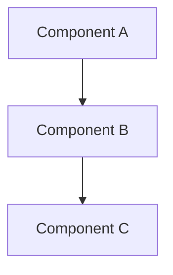
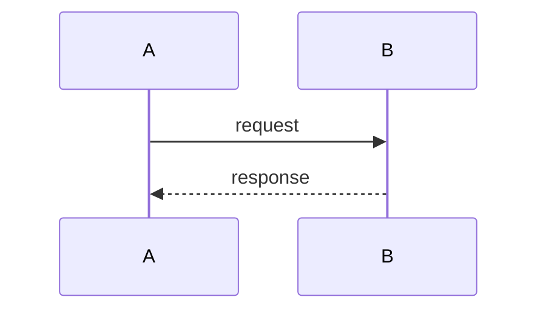

# System Architecture

Project: [project name]
Version: 0.1
Status: draft | approved
Last updated: [date]
Author: Architect (R2PO)

---

## 1. Overview

[One paragraph describing the system architecture at the highest level. What are the main moving parts and how do they relate?]

### 1.1 Component diagram



---

## 2. Technology stack

| Layer | Technology | Justification |
|---|---|---|
| [layer] | [technology] | [why this was chosen over alternatives] |

---

## 3. Components

### 3.1 [Component name]

Responsibility: [what this component does and nothing more]

Public interface:
- [method or endpoint]: [what it does, inputs, outputs]

Dependencies:
- [other component or external system]: [why and how]

---

## 4. Data model

### 4.1 [Entity name]

| Field | Type | Description |
|---|---|---|
| [field] | [type] | [what it represents] |

Relationships:
- [entity] has many [entity]
- [entity] belongs to [entity]

---

## 5. API contracts

### 5.1 [Endpoint or message name]

Type: [REST / gRPC / message / event / etc.]

Request:
```
[schema or example]
```

Response:
```
[schema or example]
```

Error cases:
- [error condition]: [response]

---

## 6. Key sequence diagrams

Include diagrams for flows that involve multiple components or have non-obvious ordering.

### 6.1 [Flow name]



---

## 7. Non-functional design decisions

### 7.1 Performance
[How does the design address performance requirements from the functional spec?]

### 7.2 Security
[Authentication mechanism, authorisation model, sensitive data handling.]

### 7.3 Error handling strategy
[How do components handle and propagate errors? What fails loudly vs. silently?]

---

## 8. Decisions and deviations

Record significant technical decisions and any deviations from this document that occurred during implementation.

| # | Decision or deviation | Reason | Date |
|---|---|---|---|
| 1 | [description] | [why] | [date] |

---

## 9. Change log

| Version | Date | Change | Author |
|---|---|---|---|
| 0.1 | [date] | Initial draft | Architect |
